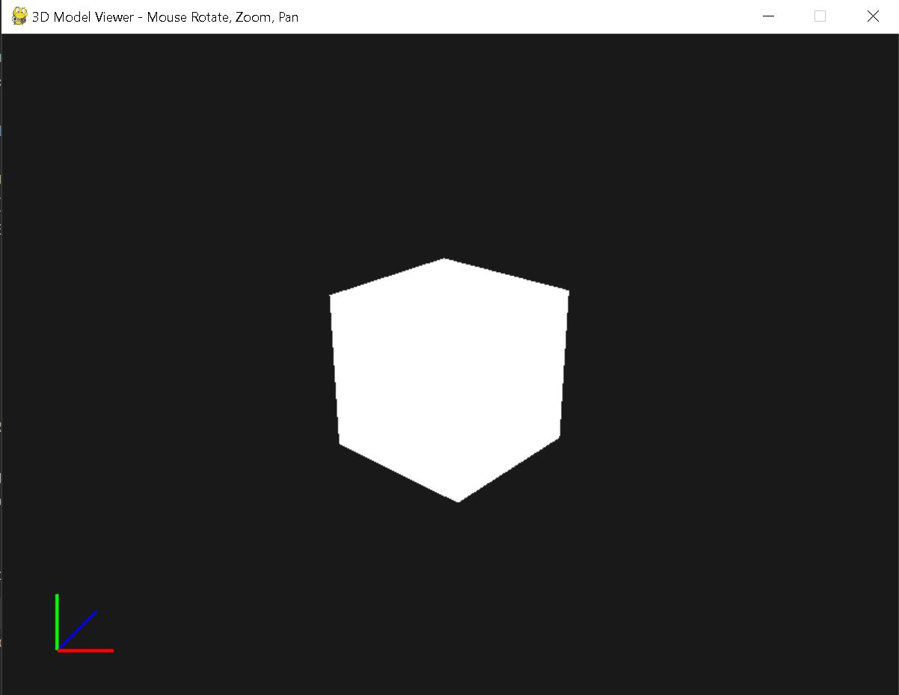

# Python 3D Model Viewer


A simple, interactive 3D model viewer built with Python, Pygame, and PyOpenGL.  
Supports loading `.obj` models and allows intuitive mouse controls for rotation, zooming, and panning. Includes a fixed HUD showing XYZ axes for orientation.


## Features

- Load and render Wavefront `.obj` 3D models using [PyWavefront](https://github.com/pywavefront/PyWavefront)
- Mouse-based controls:
  - **Left-click + drag:** Rotate the model
  - **Right-click + drag:** Pan the camera view
  - **Mouse scroll wheel:** Zoom in/out
- Fixed Heads-Up Display (HUD) showing XYZ axes:
  - Red = X axis
  - Green = Y axis
  - Blue = Z axis (diagonal)
- Easily customizable background color
- Lightweight dependencies: Python, Pygame, PyOpenGL, PyWavefront


## Demo




## Installation

1. Clone this repository:

```bash
git clone https://github.com/shualyons/python3dmodelviewer.git
cd yourrepo

---
